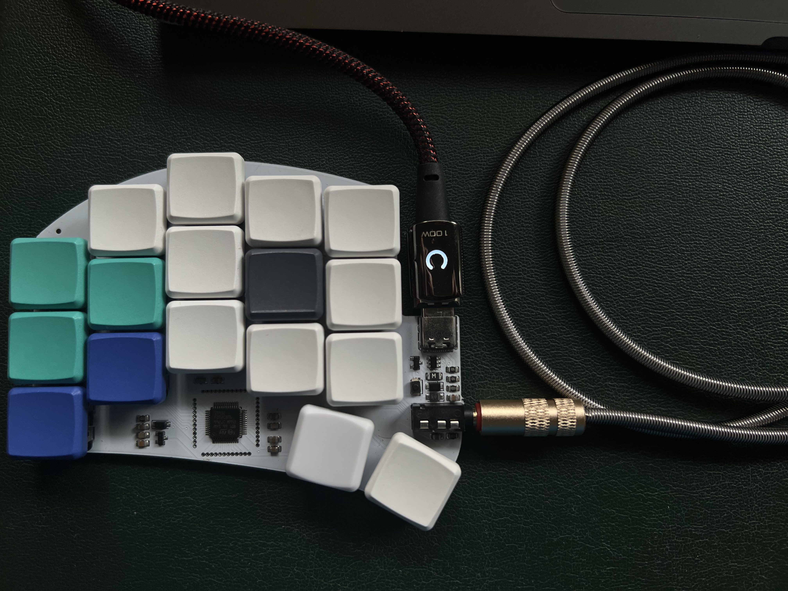
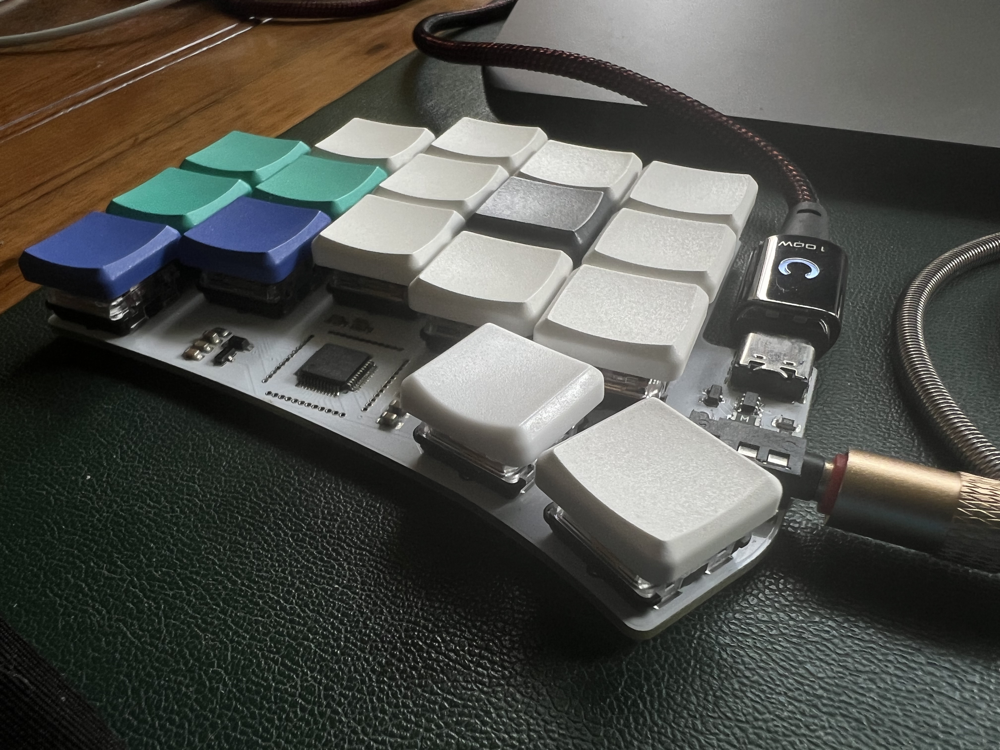
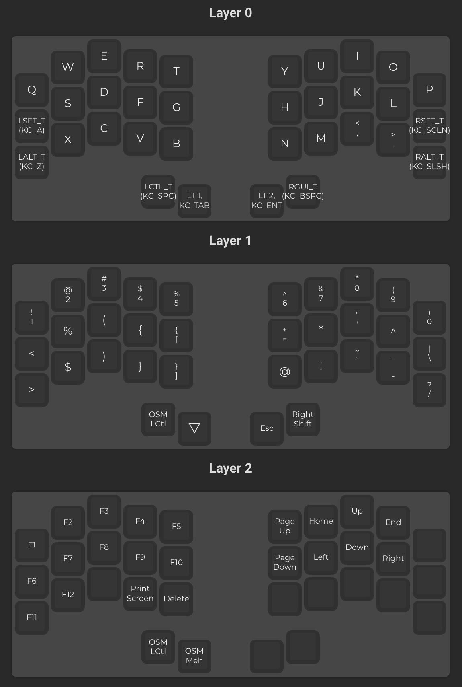

# Keyboard Layouts

## Ferris compact



The [ferris](https://github.com/pierrechevalier83/ferris) is a 4-key split keyboard focused on minimalism, portability, and ergonomic comfort. It is fully open-sourced and the firmware is contributed to the QMK project released under GPL. You can print one yourself, purchase a kit to assemlbe (including soldering), or buy a pre-built one and just add keycaps. I first came across this from [Ben Vallack's][https://www.youtube.com/watch?v=8wZ8FRwOzhU] channel where he discusses workflow optimizations including various trials with keyboards.

## QMK

[Docs](https://docs.qmk.fm/#/)

[Configerator](https://config.qmk.fm/#/ferris/0_2/compact/LAYOUT_split_3x5_2)

## Layout


## Writing layout to the board

Replace variables

### Build

```
./build.sh
```

### Flash
```
./flash.sh
```
